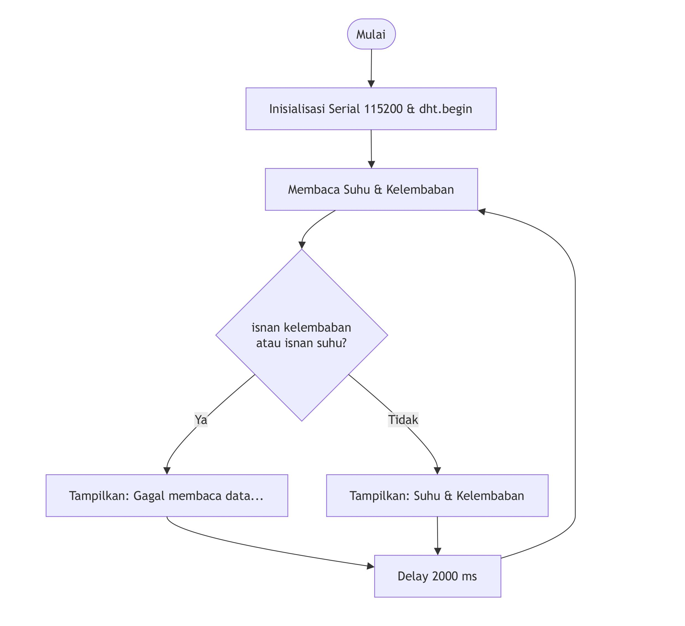
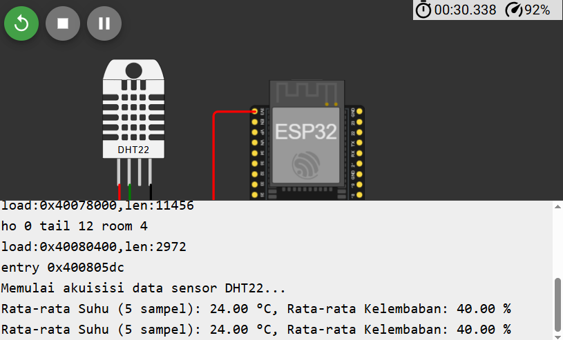
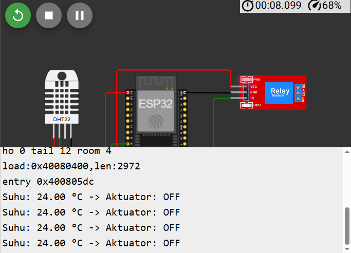

# Modul 1 : Sensor dan Aktuator 

## Tujuan Praktikum
1. Memahami konsep akuisisi data sensor pada perangkat IoT berbasis ESP32.
2. Memahami konsep dasar kendali aktuator (relay, motor servo, buzzer) menggunakan ESP32.
3. Mengimplementasikan pembacaan data sensor suhu dan kelembaban menggunakan sensor DHT22.
4. Mengimplementasikan kendali aktuator (relay) secara otomatis berdasarkan data sensor yang diperoleh.
5. Mampu menganalisis hubungan antara data sensor yang diakuisisi dengan respons
aktuator pada sistem IoT.

## Dasar Teori

Akuisisi data sensor dan kendali aktuator merupakan dua elemen fundamental dalam sistem IoT (Internet of Things). Akuisisi data sensor adalah proses pengambilan data dari lingkungan fisik (suhu, kelembaban, cahaya, jarak, dan lain-lain) melalui sensor, kemudian data tersebut diubah menjadi sinyal digital yang dapat diproses oleh mikrokontroler.
Sebaliknya, kendali aktuator adalah proses di mana mikrokontroler memberikan perintah kepada perangkat keluaran (aktuator) seperti relay, motor, atau buzzer untuk melakukan suatu aksi fisik berdasarkan hasil pengolahan data sensor. Pada kegiatan pembelajaran ini, ESP32 akan digunakan sebagai unit pemroses yang membaca data dari sensor DHT22 (suhu dan kelembaban) dan mengendalikan aktuator berupa modul relay secara otomatis.

## Tugas Pendahuluan

- 

## Alat dan Bahan

Dalam percobaan sederhana ini, berikut alat dan bahan yang digunakan:

<div align="center">
<table border="1" cellpadding="10" cellspacing="0" width="100%">
  <tr align="center">
    <th>ESP8266</th>
    <th>DHT</th>
    <th>Kabel Jumper</th>
    <th>Relay Module</th>
  </tr>

  <tr align="center">
    <td>
      <br>
    </td>
    <td>
      <br>
    </td>
    <td>
      <br>
    </td>
    <td>
      <br>
    </td>
  </tr>
</table>
</div>

## Percobaan

Eksperimen pada modul ini dibagi menjadi dua skenario utama untuk mengamati interaksi antara logika program komputer dengan respons fisik perangkat keras.

1. Percobaan 1A: 
Eksperimen ini 
* Skenario: 
* Aliran Program: 

2. Percobaan 2A: 
Eksperimen ini 
* Skenario: 
* Aliran Program: 

## Pertanyaan Praktikum

### A. 
1. Gambarkan diagram alur (flowchart) proses akuisisi data sensor DHT22 pada program di
atas!\
**Jawaban**

2. Apa fungsi dari perintah isnan() pada program tersebut?\
**Jawaban**\
digunakan untuk memeriksa apakah variabel penampung data berisi nilai yang
tidak valid.
3. Jelaskan mengapa diperlukan jeda (delay) minimal sekitar 2 detik antar pembacaan sensor
DHT22!\
**Jawaban**
DHT22 membutuhkan rentang waktu untuk konversi sinyal fisik lingkungan menjadi
sinyal digital yang stabil.
4. Modifikasi program agar data suhu dan kelembaban dirata-ratakan dari 5 kali pembacaan
sebelum ditampilkan, dan berikan penjelasan di setiap baris kode yang ditambahkan
dalam bentuk README.md!\
**Jawaban**\
Dokumentasi\

Kode
```cpp
#include <DHT.h>
#define DHTPIN 4 // Pin data DHT22 terhubung ke GPIO 4
#define DHTTYPE DHT22 // Tipe sensor yang digunakan

DHT dht(DHTPIN, DHTTYPE);

void setup() {
  Serial.begin(115200);
  dht.begin(); // Inisialisasi sensor DHT22
  Serial.println("Memulai akuisisi data sensor DHT22...");
}

void loop() {
// Variabel untuk menampung total penjumlahan dan jumlah sampel valid
  float totalSuhu = 0.0;
  float totalKelembaban = 0.0;
  int sampelValid = 0;
// Perulangan untuk mengambil 5 kali sampel data
  for (int i = 0; i < 5; i++) {
    float kelembaban = dht.readHumidity();
    float suhu = dht.readTemperature();
// Periksa apakah pembacaan sampel berhasil
    if (!isnan(kelembaban) && !isnan(suhu)) {
      totalSuhu += suhu;
      totalKelembaban += kelembaban;
      sampelValid++;
    } else {
      Serial.println("Gagal membaca data dari sensor DHT22 pada sampel ini!");
    }
    delay(2000); // Jeda 2 detik antar pembacaan sampel
  }
// Menghitung dan menampilkan rata-rata jika ada sampel yang valid
  if (sampelValid > 0) {
    float rataSuhu = totalSuhu / sampelValid;
    float rataKelembaban = totalKelembaban / sampelValid;
    Serial.print("Rata-rata Suhu (");
    Serial.print(sampelValid);
    Serial.print(" sampel): ");
    Serial.print(rataSuhu);
    Serial.print(" °C, Rata-rata Kelembaban: ");
    Serial.print(rataKelembaban);
    Serial.println(" %");
  } else {
    Serial.println("Gagal membaca data sensor dalam 5 kali percobaan!");
  }
}

```

### B. 
1. Mengapa diperlukan nilai ambang batas (threshold) dalam sistem kendali aktuator berbasis sensor?\
**Jawaban**
nilai ambang batas ini sebagai acuan untuk pengambilan keputusan (translasi data menjadi biner kondisi ON/OFF) yang bisa dimengerti oleh aktuator.
2. Jelaskan apa yang akan terjadi apabila nilai suhuThreshold diturunkan menjadi sangat rendah, misalnya 20.0!\
**Jawaban**
aktuator akan selalu menyala.
3. Apa perbedaan antara kendali aktuator secara terus-menerus (kondisi tunggal) dengan kendali menggunakan histerisis (dua ambang batas)?\
**Jawaban**
Kondisi tunggal memakai 1 titik threshold, sementara kendali histerisis menggunakan dua threshold (batas bawah dan batas atas).
4. Modifikasi program agar menggunakan dua ambang batas (histerisis), misalnya aktuator menyala pada suhu di atas 30°C dan baru mati pada suhu di bawah 28°C, dan berikan penjelasan di setiap baris kode nya dalam bentuk README.md!\
**Jawaban**\
Dokumentasi\

Kode Program
```cpp
#include <DHT.h>
#define DHTPIN 4 // Pin data DHT22 terhubung ke GPIO 4
#define DHTTYPE DHT22 // Tipe sensor yang digunakan
#define RELAYPIN 26 // Pin kendali relay

DHT dht(DHTPIN, DHTTYPE);

// Mengatur dua ambang batas (Histerisis)
const float thresholdAtas = 30.0; // Batas atas suhu (°C) untuk menyalakan aktuator
const float thresholdBawah = 28.0; // Batas bawah suhu (°C) untuk mematikan aktuator
// Variabel penampung kondisi/status aktuator (false = OFF, true = ON)
bool statusRelay = false;

void setup() {
  Serial.begin(115200);
  dht.begin();
  pinMode(RELAYPIN, OUTPUT);
  digitalWrite(RELAYPIN, LOW); // Aktuator mati di awal
}

void loop() {
// Membaca data suhu
  float suhu = dht.readTemperature();
  if (isnan(suhu)) { // Jika tidak bisa membaca data
    Serial.println("Gagal membaca data sensor!");
  } else {
    Serial.print("Suhu: ");
    Serial.print(suhu);
    Serial.print(" °C -> ");
    // Logika kendali Histerisis (Dua Ambang Batas)
    if (suhu > thresholdAtas) { // Jika suhu melebihi 30.0 °C
      statusRelay = true; // Set status relay menjadi ON
    } else if (suhu < thresholdBawah) { // Jika suhu turun di bawah 28.0 °C
      statusRelay = false; // Set status relay menjadi OFF
    }
    // Catatan: Jika suhu berada di rentang 28.0 °C - 30.0 °C,
    // statusRelay tidak berubah (mempertahankan kondisi sebelumnya)
    // Eksekusi perubahan status ke pin hardware
    if (statusRelay) {
      digitalWrite(RELAYPIN, HIGH); // Aktifkan relay
      Serial.println("Aktuator: ON");
    } else {
      digitalWrite(RELAYPIN, LOW); // Matikan relay
      Serial.println("Aktuator: OFF");
    }
  }
  delay(2000); // Jeda pembacaan setiap 2 detik
}

```